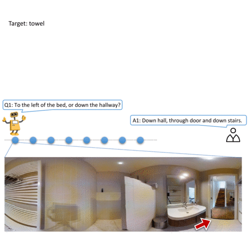

# PyTorch implementation of Cross-modal Memory Network

[**Vision-Dialog Navigation by Exploring Cross-modal Memory**](https://arxiv.org/abs/2003.06745), CVPR 2020.


<!--  -->


### Requirements

- Ubuntu 16.04
- CUDA 9.0 or 10.0
- [docker](https://askubuntu.com/questions/938700/how-do-i-install-docker-on-ubuntu-16-04-lts)
- [nvidia-docker2.0](https://github.com/nvidia/nvidia-docker/wiki/Installation-(version-2.0))

We recommend using the mattersim [Dockerfile](Dockerfile) to install the simulator. 

### Dataset Download

Download the `train`, `val_seen`, `val_unseen`, and `test` splits of the CVDN and NDH dataset by executing:
```
sh tasks/CVDN/data/download.sh
sh tasks/NDH/data/download.sh
```

### Installation

Build the docker image:
```
docker build -t mattersim .
```

Run the docker container, mounting your project path:
```
nvidia-docker run -it --shm-size 64G -v /User/home/Path_To_Project/:/Workspace/ mattersim
```

Compile the codebase:
```
mkdir build && cd build
cmake -DEGL_RENDERING=ON ..
make
```

Install python dependencies by running:
```
pip install -r tasks/NDH/requirements.txt
```

## Train and Evaluate

To train and evaluate with trusted supervision, sample feedback, and all dialog history:
```
python tasks/NDH/train.py \
    --path_type=trusted_path \
    --history=all \
    --feedback=sample \
    --eval_type=val \
    --prefix=v1
```


Train and test with trusted supervision, sample feedback, and all dialog history:

```
python tasks/NDH/train.py \
    --path_type=trusted_path \
    --history=all \
    --feedback=sample \
    --eval_type=test \
    --prefix=v1
```

To generate a summary of the agent performance:

```
python tasks/NDH/summarize_perf.py
```

## Citation

If you use the code in your research, please cite:
```bibtex
@inproceedings{zhu2020vision,
  title={Vision-Dialog Navigation by Exploring Cross-modal Memory},
  author={Zhu, Yi and Zhu, Fengda and Zhan, Zhaohuan and Lin, Bingqian and Jiao, Jianbin and Chang, Xiaojun and Liang, Xiaodan},
  booktitle={Proceedings of the IEEE/CVF Conference on Computer Vision and Pattern Recognition},
  pages={10730--10739},
  year={2020}
}
```

## Acknowledgements

This repository is built upon the 
[Matterport3DSimulator](https://github.com/peteanderson80/Matterport3DSimulator), [CVDN](https://github.com/mmurray/cvdn) and [DAN-VisDial](https://github.com/gicheonkang/DAN-VisDial) codebase.
